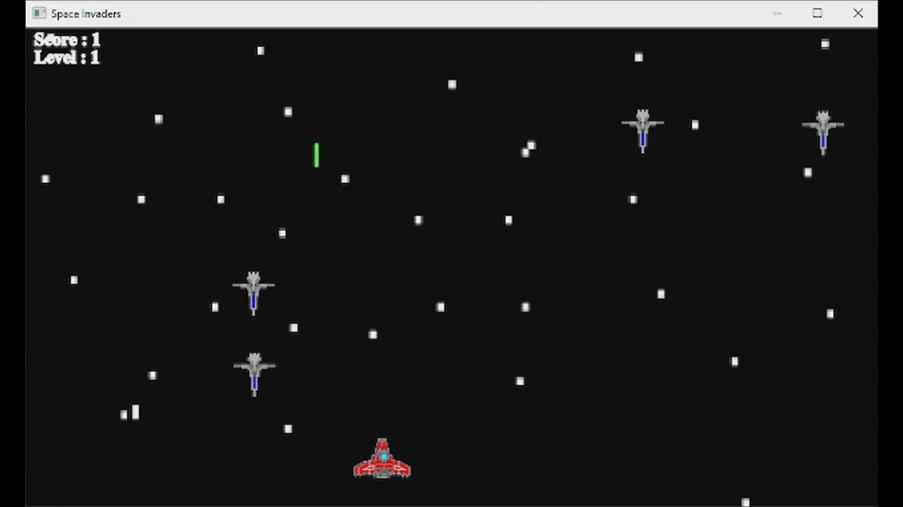
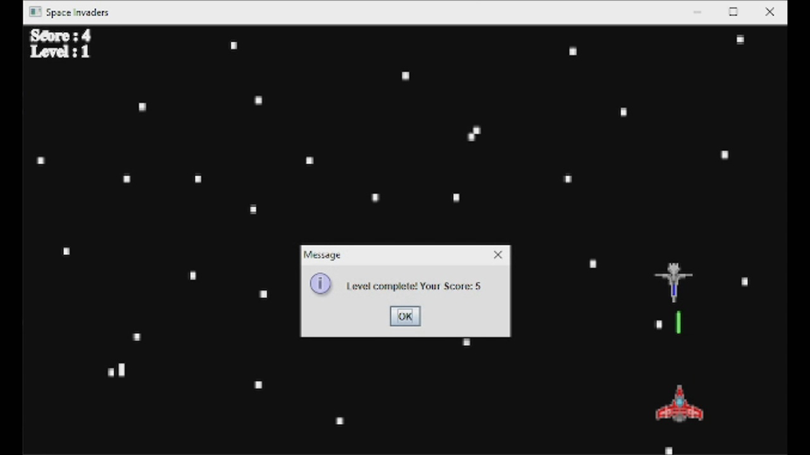
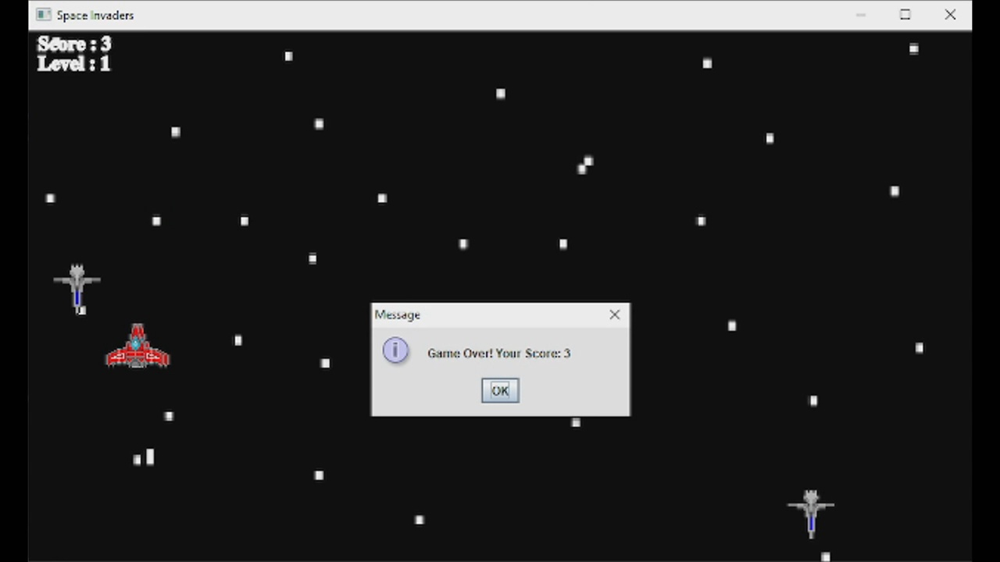

# Edge of the Universe (Inspired by SpaceInvaders)
<b>Description:</b> 
Inspired by the classic video game 'Space Invaders' released in 1978, 'Edge of the Universe' is a fast-paced shooting video game set in outer space. Use your railgun mounted on your spaceship to destroy the enemy spaceships who are trying to destroy you. Make sure to dodge their shots (and them) and be accurate with yours'. Goodluck!  
<b>Controls:</b> 
Arrow keys: UP/DOWN/LEFT/RIGHT 
Spacebar: shoot 

# Game Screenshots
<b>Screenshot1</b> 
 
<b>Screenshot2</b> 
 
<b>Screenshot3</b> 
 

# Video Sample
https://youtu.be/ZnxRDIySiWg 

# Credits:
# Directed by
Ikmal Hazim Rasyad Bin Abdul Karim 17007578 
Faliq Tan 18000809 

# Framework provided by
Sir Arwan Ahmad Khoiruddin 

# Special thanks to
Friends we have made along the way in OOP class 
Sir Arwan Ahmad Khoiruddin, our lab tutor for providing deeper knowledge on gaming development 
Sir Nordin Zakaria for all the teaching in OOP, opening our eyes to the world of programming 

# Legal: We do not own any of the assets used in this project.
# Will take down upon request

